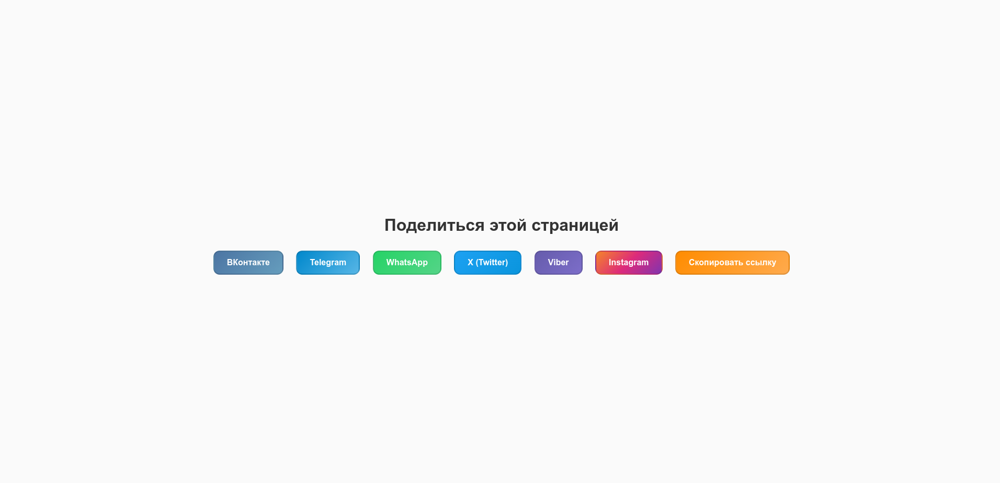

# Скрипт «Поделиться» в социальных сетях для веб-мастеров

Этот проект представляет собой универсальный скрипт для добавления кнопок "Поделиться" на страницы вашего сайта. Он поддерживает популярные социальные сети, такие как ВКонтакте, Telegram, WhatsApp, Twitter, Instagram, Viber и другие. Скрипт позволяет пользователям делиться ссылками, а также копировать их в буфер обмена.

## Демонстрация

Посмотрите видео и скриншоты ниже, чтобы увидеть, как работает скрипт.

### Видео демо

## Особенности

- Поддержка кнопок "Поделиться" для популярных социальных сетей.
- Функция копирования ссылки в буфер обмена.
- Модальное окно для уведомления пользователя.
- Простота интеграции: всего несколько строк кода на вашем сайте.

## Использование

1. Склонируйте репозиторий:

bash
   git clone https://github.com/your-username/social_share_ru.git
   
